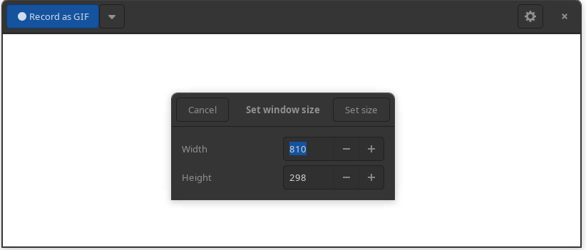
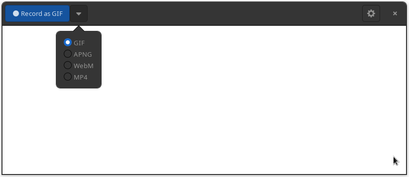
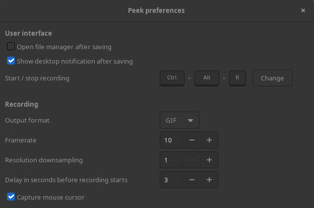

# 简单好用的 linux 录屏工具 peek

发现一款简单好用的 Linux 录屏工具[peek](https://github.com/phw/peek)，

适用于：

- Arch Linux
- Debian
- Fedora
- Gentoo
- NixOS
- OpenSUSE Tumbleweed
- Parabola
- Solus

通过包管理器下载，安装即用。

框住哪里录哪里，可以直接拖拽窗口调整录制范围，也可以输入具体尺寸。

有 GIF、APNG、WebM、MP4 四种储存格式可选。

还有更多选项，基本可满足日常使用需求，强烈推荐。
